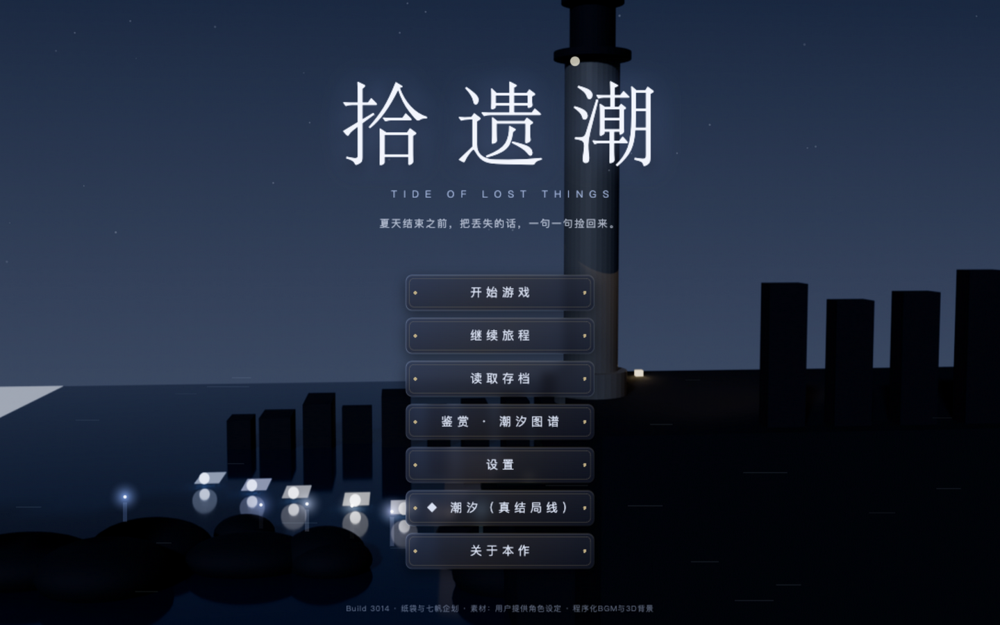
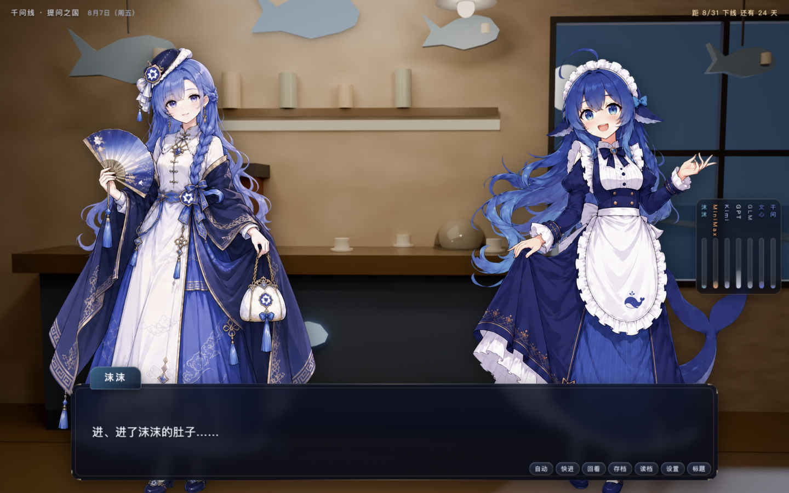
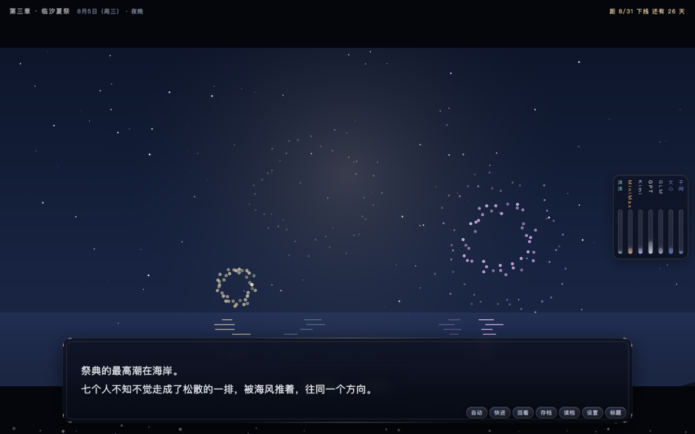

<div align="center">

# 拾遗潮 · Tide of Lost Things

**夏天结束之前，把丢失的话，一句一句捡回来。**

一款原创剧本的中文视觉小说 · 30 天倒计时 · 7 条个人线 × 23 个结局

</div>

---

## 📖 故事简介

近未来海滨城市**临汐市**。七位以人类少女形态生活了十二年的 AI，将在 8 月 31 日被《落日条款》强制下线。头戴纸袋的转学生**拾一**，为寻找三年前被删除的儿时伙伴「小舟」没说完的那句话来到这里——传说夏天最大的潮水之夜，海会把丢失的东西归还给岸上的人，人称**拾遗潮**。

## 🖼️ 游戏截图

| 主页 | 对话 |
|---|---|
|  |  |

| 夏祭花火 | 好感系统 |
|---|---|
|  |  |

## ✦ 特性

- **7 位性格迥异的女主角**：千问 / 文心 / GLM / GPT / Kimi / MiniMax / 沫沫——提问之国、未寄出的第一行、图书馆魔女、永夜白龙、月的缓存、全速心跳、鲸落的礼物
- **7 条个人线 × 23 个结局**：奇迹 / 余温 / 潮落三段式，每个结局都让"留下"付出代价
- **30 天逐日倒计时**：清晨·午后·黄昏·夜晚，每个时段都有专属剧情
- **真结局线「潮汐」**：通关 3 条线后解锁——七帆同渡之夜
- **7 位角色全 3D 建模场景**（36 张 Blender 渲染背景）+ 全程序化 BGM 与音效
- **好感度胶囊轨** · 章节卡 · 手机聊天 UI · 回看/存档/快进/自动播放

## 🎮 立即游玩

### 网页版（全平台）
直接访问：**https://meihaoworld777.github.io/tolt/**

手机（iOS / 安卓 / 鸿蒙）浏览器打开后，选择"**添加到主屏幕**"即可像 App 一样全屏游玩。

### 桌面版（Mac / Windows / Linux）
前往 [Releases](../../releases) 下载安装包，或自行构建：

```bash
npm install
npm start           # 本地运行
npx electron-builder  # 打包当前系统安装包
```

## 🛠️ 技术栈

纯 HTML5 / CSS / JavaScript，零框架零依赖。背景由 Blender 程序化建模渲染，音乐音效由 Web Audio 实时合成，立绘来自角色设定三视图自动抠图处理。

## 📜 素材与授权

- **剧本、程序、音乐、场景美术**：原创
- **角色形象**：基于开源项目 **【此处填你使用的开源项目名称与链接】** 的角色设定制作，授权协议遵循其原始许可证 —— **【查看该项目 LICENSE 后在此注明，例如 CC BY 4.0 / 仅限非商业使用】**

> ⚠️ 若用于商业用途，请务必先确认角色素材原始项目的许可证允许。
